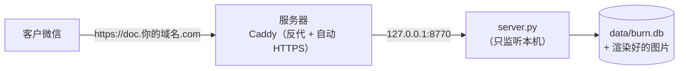

# 部署到「已备案域名 + 一台服务器」

> 域名已备案时，用一个二级域名指向服务器即可，不用重新备案。
> 微信里能打开的条件是：已备案域名 + HTTPS。服务器在哪里不影响这一条。

---

## 0. 架构



---

## 1. ⚠️ 先做这件事：保住你的备案

**把主域名解析改到另一台机器 = 备案的接入信息和实际不符**，有被抽查整改、甚至取消接入的风险。

**做法：用二级域名，别动主域名。**

| 记录 | 指向 | 说明 |
|---|---|---|
| `www` / `@`（主域名） | **保持原样**（指向原来的境内接入商） | **别改**，这是保住备案的关键 |
| `doc`（新增二级域名） | 这台服务器的 IP | 只把这一条指出去 |

这样备案主体和主域名接入都没变，风险最小。

> 如果这个域名本来就是随便注册、无所谓备案：那直接把主域名指过去也行。

---

## 2. 服务器上装环境

### Linux（推荐）

```bash
sudo apt update && sudo apt install -y python3 python3-pip
pip3 install pymupdf          # 只需要这一个第三方库
python3 -c "import pymupdf; print(pymupdf.__doc__.strip())"   # 验证
```

### Windows

装 Python 3.12（勾选 Add to PATH），然后：

```powershell
pip install pymupdf
```

---

## 3. 把代码传上去

```bash
# 本地（Windows）用 scp 或 MobaXterm / WinSCP 把整个 pdf-burn 目录传上去
scp -r pdf-burn user@<服务器IP>:/opt/burnpdf
```

Linux 上正式目录建议 `/opt/burnpdf`，可以先直接跑一次确认能起来：

```bash
cd /opt/burnpdf
python3 make_sample.py          # 生成示例 PDF
python3 server.py               # 前台跑一次，看到"管理密钥"就说明 OK，Ctrl+C 停
```

> ⚠️ 别忘了把 `data/` 目录的写权限给运行用户（`chown -R www-data:www-data /opt/burnpdf/data`）。

---

## 4. 开机自启

### Linux：systemd

```bash
sudo tee /etc/systemd/system/burnpdf.service > /dev/null <<'EOF'
[Unit]
Description=BurnPDF (阅后即焚 PDF)
After=network.target

[Service]
Type=simple
WorkingDirectory=/opt/burnpdf
ExecStart=/usr/bin/python3 /opt/burnpdf/server.py
Restart=always
RestartSec=3
User=www-data

[Install]
WantedBy=multi-user.target
EOF

sudo systemctl daemon-reload
sudo systemctl enable --now burnpdf
sudo systemctl status burnpdf        # 看是否 active (running)
```

### Windows：NSSM

```powershell
# 下载 nssm.exe 放到 C:\nssm\
C:\nssm\nssm.exe install BurnPDF "D:\Python312\python.exe" "D:\burnpdf\server.py"
C:\nssm\nssm.exe set BurnPDF AppDirectory "D:\burnpdf"
C:\nssm\nssm.exe set BurnPDF Start SERVICE_AUTO_START
C:\nssm\nssm.exe start BurnPDF
```

（不想装 NSSM 就用「计划任务 → 计算机启动时运行」，勾"不管用户是否登录"。）

---

## 5. 反代 + HTTPS（Caddy）

Caddy 会自动申请并续期证书，两行配置搞定。

### Linux

```bash
sudo apt install -y debian-keyring debian-archive-keyring apt-transport-https curl
curl -1sLf 'https://dl.cloudsmith.io/public/caddy/stable/gpg.key' | sudo gpg --dearmor -o /usr/share/keyrings/caddy-stable-archive-keyring.gpg
curl -1sLf 'https://dl.cloudsmith.io/public/caddy/stable/debian.deb.txt' | sudo tee /etc/apt/sources.list.d/caddy-stable.list
sudo apt update && sudo apt install -y caddy
```

`/etc/caddy/Caddyfile`：

```caddyfile
doc.你的域名.com {
    encode gzip
    reverse_proxy 127.0.0.1:8770
}
```

```bash
sudo systemctl reload caddy
```

### Windows

下载 `caddy.exe` 放到 `C:\caddy\`，同目录放 `Caddyfile`（同上），然后：

```powershell
cd C:\caddy
.\caddy.exe run          # 先手动跑一次看证书是否签发成功
```

确认没问题后，用 NSSM 把 `caddy.exe run` 也注册成服务。

---

## 6. 防火墙（只放 80/443）

```bash
sudo ufw allow 80,443/tcp
sudo ufw enable
# 8770 不要对外开放
```

云厂商控制台的**安全组**同样只放 80/443。默认全开的规则要收紧。

---

## 7. 带宽小 → 把图片调小

轻量服务器常见只有 **1–3 Mbps 上行**。以下是纯文字报价单（3 页）的参考值：

| 档位 | scale / quality | **实测每页** | 3 页在 1 Mbps 下 | 适用 |
|---|---|---|---|---|
| 标准 | 2.0 / 88 | **137 KB** | 约 3.3 秒 | 带宽 ≥ 5 Mbps |
| **省流量（推荐）** | 1.5 / 78 | **75 KB** | 约 1.8 秒 | 小带宽 |
| 极小 | 1.2 / 72 | ~50 KB | 约 1.2 秒 | 只有 1 Mbps，以文字为主 |

> 含照片、细线图纸的文件会明显更大（按倍数估）。
> **图纸/细线别压太狠**，线条会发虚 —— 可以只降 quality、不降 scale。

---

## 8. 上线后自检（5 分钟）

| # | 检查 | 期望 |
|---|---|---|
| 1 | 浏览器打开 `https://doc.你的域名.com/admin` | 能打开、地址栏有小锁（HTTPS 生效） |
| 2 | 粘贴 `data/admin.key` 里的密钥点「保存并连接」 | 显示「已连接 ✓」 |
| 3 | 传一份 PDF，限 1 次 | 生成链接 |
| 4 | **用自己的手机微信**打开这条链接 → 点「开始阅读」 | 能正常显示页面（**这一步才是真正的验收**） |
| 5 | 退出后**再点一次同一链接** | 显示「链接已失效，该文件仅可查看 1 次」 |
| 6 | 管理台「日志」 | 能看到刚才那次访问的时间 |

---

## 9. 常见问题

| 现象 | 原因 / 处理 |
|---|---|
| 微信里提示"网页包含风险内容" | 域名已备案但**被举报过**或命中了风控 → 微信里搜"腾讯客服-域名申诉"提交；先确认主域名没违规 |
| 浏览器打不开，但服务器本地 `curl 127.0.0.1:8770` 正常 | 安全组 / 防火墙没放 443 |
| 证书签发失败 | 80 端口不通（Caddy 的 HTTP-01 校验要用 80）；或域名没解析到这台机器（`ping doc.你的域名.com` 确认） |
| 微信里打开很慢 | 上行带宽太小 → 按 §7 调小图片；或给域名套一层 CDN |
| 管理台打不开 / 密钥不对 | 密钥在服务器 `data/admin.key`；`sudo cat /opt/burnpdf/data/admin.key` |
| 想看服务日志 | `sudo journalctl -u burnpdf -f` |

---

## 10. 日常使用回顾

1. 开 `https://doc.你的域名.com/admin` → 选 PDF → 填参数（次数 1 / 10 分钟 / 3 天 / 水印=客户名）→ 生成；
2. **只发链接**（微信里直接粘链接，或转成二维码）—— 不要发 `.pdf` 文件；
3. 客户打开后，管理台「日志」能看到时间和次数；
4. 客户说还想看 → 管理台「作废」旧的，重新发一条；或直接把次数改成 2 后重发。
