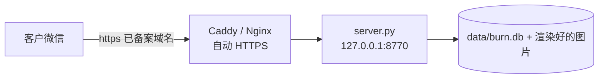

# 阅后即焚 PDF（自建）

> 把 PDF 变成一条**由服务端控制"还能开几次"的链接**。
> 客户在微信里点开就能看，看完次数就没了 —— 原 PDF 文件从头到尾不下发。

---

## 为什么这么做

直接发 `.pdf` 文件是收不回来的：对方另存、转发、永久留存，你都看不到。
所以这里换一个思路 —— **不发文件，发入口**：

```
你上传 PDF  →  服务端把它转成图片（原文件留在你自己的服务器上）
                      ↓
客户点链接   →  「开始阅读」按钮  →  扣 1 次  →  逐页下发图片（带水印）
                      ↓
次数用完 / 过期 / 你手动作废  →  链接再也打不开
```

**能做到**：限总次数（真正意义上的"看一次就失效"）、限单次时长、限到期时间、
禁止下载/打印/复制（提高门槛）、水印烧进图片、访问日志、一键作废。

**做不到**（别指望，别的产品也做不到）：阻止对方用手机截图、拍照。
—— 所以水印才是重点，它让截图带着"是谁看的"一起流出去。

---

## 文件说明

| 文件 | 作用 |
|---|---|
| `server.py` | 后端：发布、计次、取图、作废、日志、管理页（**只依赖 PyMuPDF，其余全是标准库**） |
| `viewer.html` | 客户看到的阅读页（入口页 → 阅读页 → 失效页） |
| `admin.html` | 你自己的管理台（上传、参数、列表、作废、日志、复制链接） |
| `publish.py` | 命令行发布，方便脚本化 / 以后跟 ERP 打通 |
| `make_sample.py` | 生成一份测试用的中文报价单 PDF |
| `selftest.py` | 接口回归测试（21 条断言，改代码后跑一遍） |
| `data/` | 运行时生成：`burn.db`（SQLite）、`docs/<token>/`（渲染出来的图）、`admin.key` |

---

## 快速开始

```powershell
cd pdf-burn
D:\Python312\python.exe make_sample.py        # 生成示例 PDF（第一次才需要）
D:\Python312\python.exe server.py             # 启动服务（常驻）
```

启动后控制台会打印**管理台地址**和**管理密钥**：

```
管理台   http://127.0.0.1:8770/admin
管理密钥 <首次启动时生成>      ← 也保存在 data/admin.key
```

日常使用走管理台就行：打开 `/admin` → 粘贴密钥 → 选 PDF → 填参数 → 生成链接 → 发给客户。

命令行方式：

```powershell
D:\Python312\python.exe publish.py samples\sample-quote.pdf `
    --limit 1 --duration 10 --days 3 --strips 4 `
    --watermark "仅限 XX 电子 2026-09-30"
```

参数含义：

| 参数 | 说明 | 建议值 |
|---|---|---|
| `--limit` | 可查看**总次数** | 报价单填 `1`；客户容易看不清就填 `2` |
| `--duration` | 单次可看**分钟**数，到点自动关页 | `10` |
| `--days` | 链接有效期（天），`0`=永久 | `3` |
| `--strips` | 每页切成几条下发（≥2 能防"长按保存整页"） | 报价单 `4`；图纸 `6` |
| `--watermark` | 烧进图片的水印文字 | 客户公司名 + 日期 |

---

## 关键设计（这几条不做对就会出 bug）

1. **扣次时机 = 客户点「开始阅读」那一刻**，不是打开链接那一刻。
   打开链接只是看一眼说明页，不扣次 —— 否则转发出去的链接谁点一下就把你的次数吃掉了。
2. **扣完次之后，本次会话仍要能取图**。次数是"入场券"，`session` 才是"通行证"。
   （这条踩过坑：早期版本在取图接口里又拿"剩余次数"当门槛，结果限 1 次的文档一扣完次就自己取不到图。）
3. **刷新页面不重复扣次**。客户在微信里切后台回来会重载页面，
   所以前端把 `sid` 存在 `sessionStorage` 里，回来时复用同一个会话。
   （这条也踩过坑：判定顺序写反了，客户一刷新就被判"已查看完"。）
4. **60 秒宽限退次数**：扣了次数但一页都没加载出来（网络抖动、误触），
   下次打开时自动把那一次退回来 —— 避免"客户什么都没看到，次数没了"。
5. **原 PDF 永不下发**。服务端转成图片再说；水印也是用 PyMuPDF 直接画进页里，
   前端删不掉、右键存下来也带着水印。
6. **图片按 session 授权**。URL 里带一次性 `sid`，伪造 / 越界 / 超时都会被拒。

---

## 部署到公网（客户才能点开）



| 项 | 说明 |
|---|---|
| 服务器 | 任意一台能上网的机器；轻量云服务器 1 核 2G 足够 |
| **域名** | ⚠️ **微信里打开必须是已备案域名**。**省事技巧：公司已有备案官网的，直接把 `/v/` 反代到本服务**，不用重新备案，当天能用 |
| HTTPS | Caddy 两行搞定（证书自动签发）：<br/>`view.your-domain.com { reverse_proxy 127.0.0.1:8770 }` |
| 开机自启 | Linux：写个 systemd unit；Windows：用 NSSM 注册成服务，或计划任务 |
| 端口 | 只放行 80/443，`8770` 不要直接暴露到公网 |

> 内网穿透（frp / cpolar 等）拿到的域名在微信里经常被拦，只适合临时让客户在浏览器里打开。

改端口 / 改默认值：`server.py` 顶部的 `HOST / PORT / DEFAULT_*` 常量。

---

## 改完代码先跑自测

```powershell
D:\Python312\python.exe selftest.py
```

会自己发布测试文档，检查：计次、**扣完次仍能取图**、伪造 session 被拒、
刷新不重复扣次、宽限退次数、作废/恢复、过期、管理接口鉴权。

---

## 已知可以再改进的地方

- 水印目前是**静态**的（发布时确定）。想做成"每次打开一个编号"需要改成按请求动态渲染。
- 管理台没有二维码生成（手机自带分享或第三方工具即可）。
- 只支持 PDF + 中文水印；图片格式固定 JPEG（图纸细线多的话可在管理台把切条数调高、或改 `quality`）。
- 日志按需清理（`data/burn.db` 里的 `logs` 表）。
